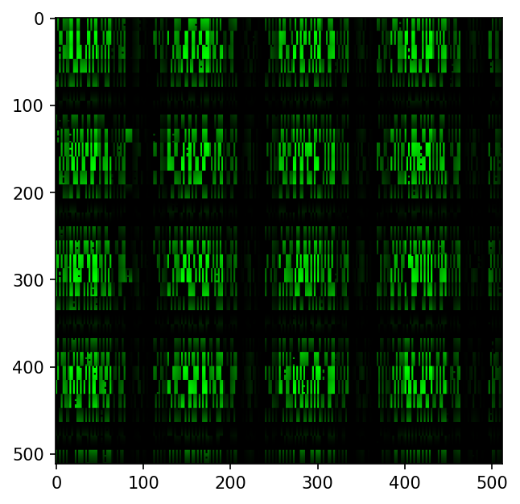
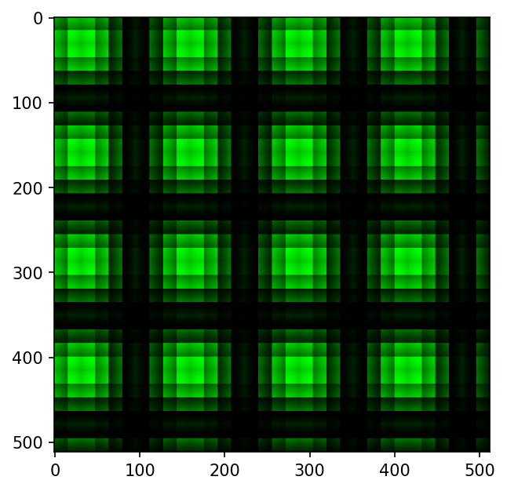
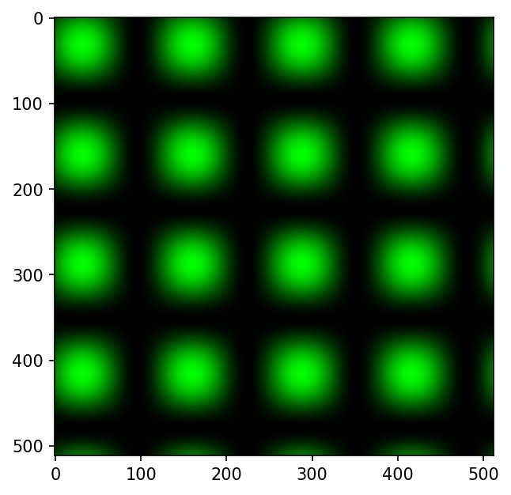

# Thread cooperation and synchronization

## Barrier synchronization
* Threads take different amount of time to complete part of computation
* Sometimes, you want all threads to reach a particular point before continuing their work
* CUDA provides a thread barrier function `__syncthreads()`
* A thread that calls `__syncthreads()` waits until other threads to reach this line
* Then, all thread continue executing

### Synchronization demo
In the demo `bitmap.cu`, we generate a 512*512 pixel image, where each pixel is itself a 4-character (character in the 1-byte `char` datatype sense, it is still technically an integer).
However, we purposely introduce thread collisions by having each thread alternately read/write from different locations in shared memory. Without synchonization, one thread may read from a location that hasn't been written to yet, and picks up whatever crap was there when it was initialized. This results in an image like this

where there are obvious visual imperfections due to this race phenomenon.
By introducing the thread barrier function `__syncthreads()` just before the read operation, we can ensure that all threads have completed their write operation first, eliminating the noise:

If we eliminate the thread collisions entirely (each thread reads/writes to its own distinct area in memory), then it looks like this:

If you're interested, each thread was told to compute a single pixel with intensity equal to
$$
I_{x,y} = \lfloor 255 (\sin(2\pi x/T) + 1) (\sin(2\pi y/T) + 1) / 4 \rfloor
$$
where $x$, $y$ are the thread indexes, and $T = 128$.
The first two images are actually what happens when you map $(x, y) \rightarrow (15-x, 15-y)$ within each thread block.

## Warp divergence
* Up until now, you might have thought that you can run different code on different threads however, that is not the case
* Once a block is assigned to a SM, it is split up into several "warps"
* All threads within a warp must execute the same instruction at the same time
* this potentially poses a problem because `if` and `else` branches cannot be completed concurrently
    * first, all the threads in the `if` branch get executed first, then all the threads in the `else` branch
    * this leads to a bit of performance loss because now the instructions are not executed simultaneously
* not much that can be done
    * simply avoid branching if possible
    * if you do have branches, try to cut them on warp boundaries so that one warp executes the `if`, and another warp executes the `else`, but it is all done concurrently
        